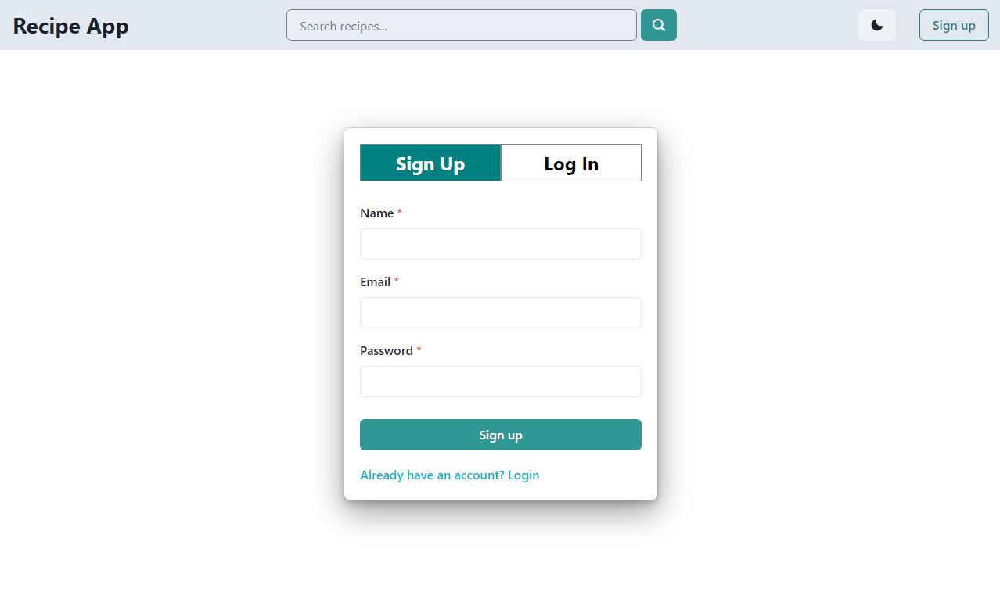
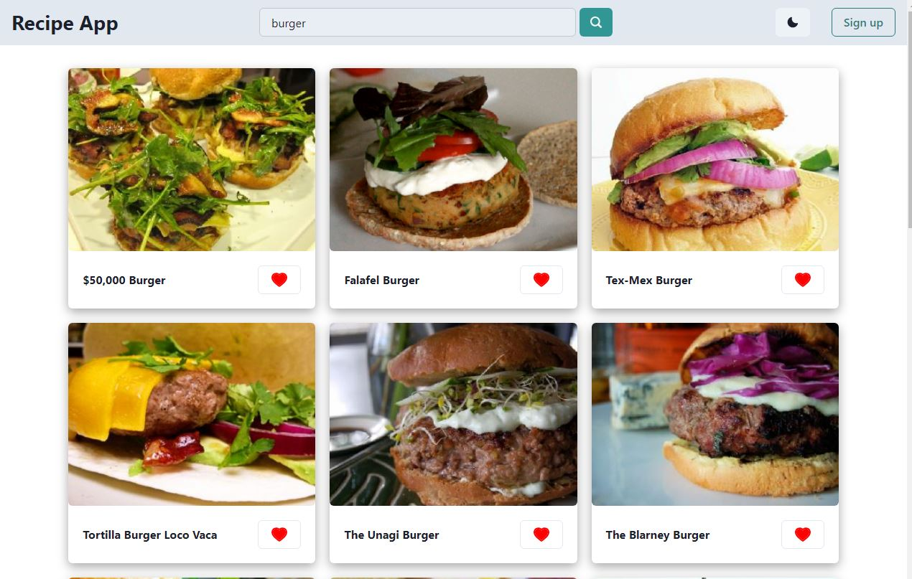

# Recipe Application

### Overview
The Recipe Application is a web-based platform that allows users to explore and manage their favorite recipes. Users can view recipe details, add recipes to their favorites, and delete recipes from their favorites.

## Features
### 1. User Authentication
- Users can create accounts or log in with existing credentials.
- Authentication is implemented using JWT (JSON Web Tokens) for secure access.


### 2. Recipe Search
- Users can search for recipes based on keywords, ingredients, or categories.
- Recipe search utilizes the Spoonacular API to fetch recipe data.

### 3. Recipe Details
- Users can view detailed information about a selected recipe, including ingredients, cooking instructions, and cooking time.


### 4. Favorite Recipes
- Users can add recipes to their list of favorite recipes.
- Favorite recipes are stored in the user's profile.


### 5. Profile Page
- Users have a profile page where they can view their favorite recipes.
- They can also delete recipes from their favorites(To be implemented later).


## Tech Stack Used
- Frontend: React.js + Chakra-Ui + React-router-dom
- Backend: Node.js (Express.js)
- Database: MongoDB
- Authentication: JWT (JSON Web Token)
- API Integration: Spoonacular API for recipe data

## Project Structure


## Installation

1. Clone the repository:
   
2. Install frontend dependencies:
   ```sh
   cd client
   npm install
   ```
3. Install backend dependencies:
   ```sh
   cd server
   npm install
   ```


4. Create a .env file in the server directory with the following variables:
   ```js
   PORT=8080
   mongoURL=<your-mongodb-url>
   JWT_SECRET_KEY=<your-secret-key>
   API_KEY=<your-spoonacular-api-key>  ';
   
5. Start the frontend and backend servers:
 - Frontend:
    ```sh
    cd client
    npm start
    ```

- Backend:
  ```sh
    cd server
    npm start
  ```
6. Access the application in your web browser at http://localhost:8080.

### Usage
- Users can sign up for an account or log in with existing credentials.
- Search for recipes, view recipe details, and add recipes to their favorites.
- Visit the profile page to manage their favorite recipes.
- Log out when done.
